   

<br>
<br>

# Tema 9. Acceso a datos. Persistencia en la nube.

[*1.	Introducción a Supabase con Flutter*](#_apartado1)

[*2.	Preparación de nuestro proyecto. Creación de la tabla y del proyecto de Consola.*](#_apartado2)

[*3.	MVC*](#_apartado3)

[*4.	Programa Students. Modelo y Conexión Cliente Supabase*](#_apartado4)

[*5.	Programa Students. Repositorio*](#_apartado5)

[*6.	Programa Students. Controlador*](#_apartado6)

<br>

La persistencia de los datos es una pieza fundamental en el desarrollo de aplicaciones, para la que se nos presentan opciones diversas, como el almacenamiento local haciendo uso de archivos, ya sean en texto plano, binarios o estructurados, bases de datos de diferentes tipos, o bien directamente en la nube.

La persistencia en la nube se refiere al almacenamiento y gestión de datos en servidores remotos accesibles a través de internet. Esta tecnología permite a las aplicaciones almacenar datos de manera segura y escalable, eliminando la necesidad de infraestructura física local. Los servicios de persistencia en la nube ofrecen ventajas como alta disponibilidad, recuperación ante desastres, y acceso global, lo que facilita la colaboración y el acceso a la información desde cualquier lugar.

En este tema vamos a trabajar con `Supabase`, que es una plataforma de código abierto que proporciona una solución completa para la persistencia en la nube, incluyendo bases de datos, autenticación y capacidades en tiempo real. 


# <a name="_apartado1"></a>1. Introducción a Supabase con Flutter

[Supabase](https://supabase.com/) es una plataforma de código abierto que proporciona una solución completa para el desarrollo de aplicaciones backend. Ofrece una serie de servicios integrados que incluyen bases de datos, autenticación, almacenamiento y capacidades en tiempo real, todo gestionado a través de una interfaz intuitiva y fácil de usar.

Supabase se basa en PostgreSQL, una de las bases de datos relacionales más robustas y populares, lo que garantiza un rendimiento y una fiabilidad excepcionales. Además, su enfoque en la simplicidad y la accesibilidad lo hace ideal tanto para desarrolladores principiantes como para aquellos con más experiencia.

Entre las características destacadas de Supabase se encuentran:

- **Autenticación y Autorización:** Gestión de usuarios y permisos de manera segura.
  
- **API en Tiempo Real:** Sincronización de datos en tiempo real entre el cliente y el servidor
  
- **Almacenamiento de Archivos:** Solución integrada para almacenar y gestionar archivos.

- **Fácil Integración:** Compatible con múltiples frameworks y lenguajes de programación, incluyendo Flutter, React, y más.

De manera resumida estos podrían ser los pasos para utilizar **Supabase** desde una aplicación **Flutter**:

- Registro en Supabase.

- Creación de un Proyecto: Una vez registrado, crea un nuevo proyecto en el panel de Supabase.

- Crear las tablas de la BD.

- Credenciales: Copia la URL del proyecto y la clave API (anon key).

- Añadir dependencias en el proyecto de C#.

- Inicializar Supabase en la aplicación.

- Realizar operaciones CRUD utilizando el cliente Supabase.

Vamos a ver en este apartado los pasos para registrarnos, crear el proyecto y crear la tabla para utilizar a continuación en la aplicación.

## Registro en Supabase

Tenemos al ir a la web de [Supabase](https://supabase.com/) pulsaremos *Sign in* o *Start your project* y bien crear un nuevo usuario a partir de un correo, o bien entrar con nuestra cuenta de Github:

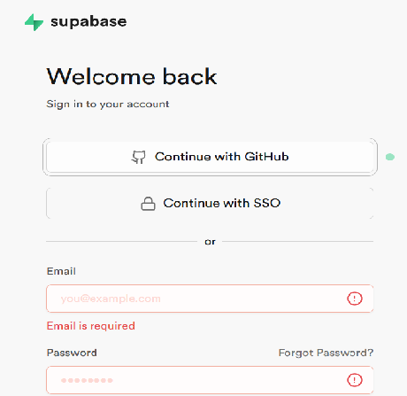

<br>

**La primera vez** debemos crear una organización:

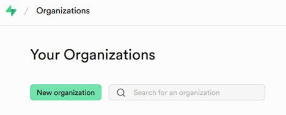

Y ahora crearemos un **nuevo proyecto** (también la primera vez). Este proyecto contendrá nuestra BD:

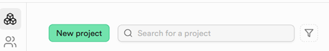

<br>
<br>

# <a name="_apartado2"></a>2. Preparación de nuestro proyecto. Creación de la tabla y del proyecto de Consola.

### Definición de la tabla `students` en Supabase

Para crear la nueva tabla que vamos a utilizar en nuestro proyecto tenemos dos opciones.

- Crearlo desde el apartado **Table Editor**:
  
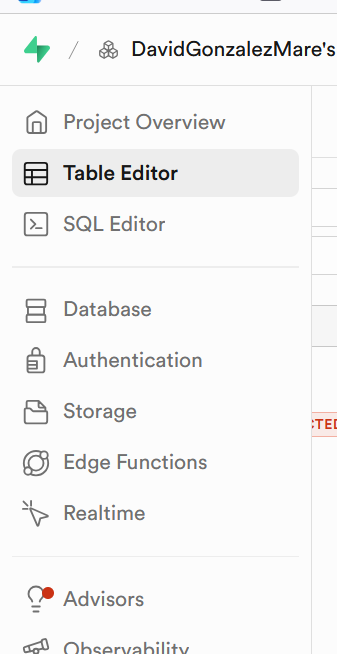

Pulsando para ello **New Table**:

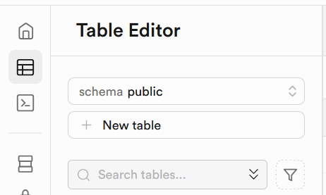

Y empezamos a definir nuestra tabla:

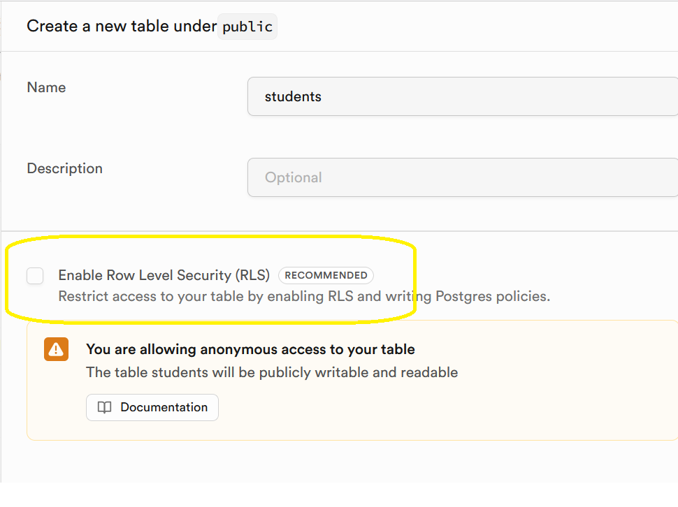

como vemos, de momento vamos a quitar el Row Level Security (RLS) que nos permite hacer cambios en los registros de la tabla sin ningún tipo de restricción de usuario (esto lo tendremos que cambiar más adelante por seguridad).

Su estructura podría ser la siguiente:

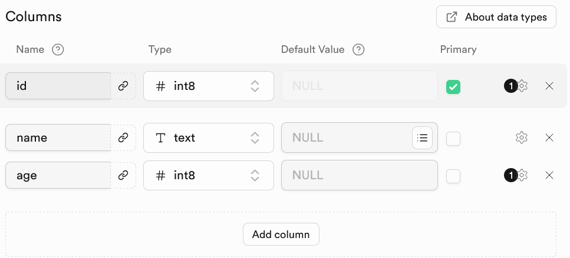

Es importante que la clave primaria id sea autoincremental.

También podríamos crear la tabla utilizando el **SQL Editor** y ejecutando la siguiente sentencia:

```sql
create table public.students (
  id bigint generated by default as identity not null,
  name text not null,
  age bigint null,
  constraint students_pkey primary key (id)
) TABLESPACE pg_default;
```
<br>

### Creación del proyecto de Visual Studio C#.

Para este primer ejemplo vamos a trabajar con una aplicación de Consola, pero vamos a trabajar en este caso con **Aplicación de Consola**.

- Dentro de Visual Studio .NET elegimos: **Archivo->Nuevo->Proyecto**.

- Elegimos Aplicación de Consola como tipo de proyecto (No .NET Framework):
  
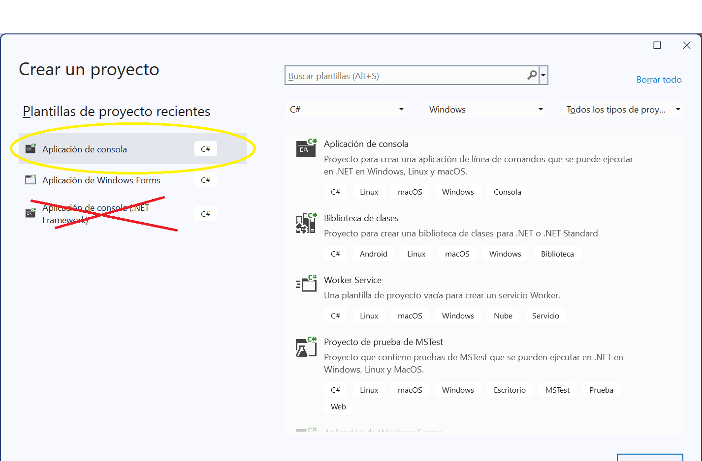

- Damos nombre y carpeta a nuestro proyecto.

- Elegimos **No usar instrucciones de nivel superior**:

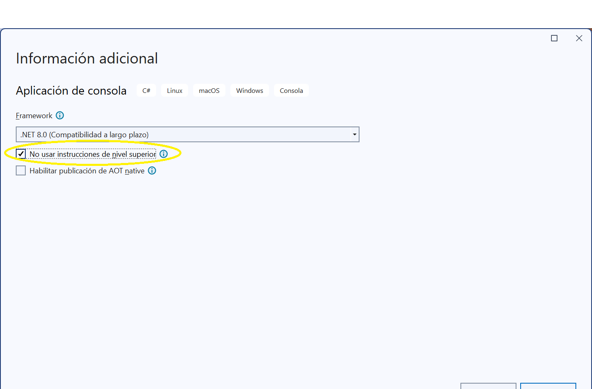

Con ello conseguimos tener un Main como hemos trabajado hasta ahora.

Además, para poder conectar con Supabase, necesitamos instalar en nuestro proyecto los paquetes Supabase y Supabase.Postgrest.

Para ello, vamos a **Proyecto->Administrar paquetes NuGet...**
Y buscamos e instalamos el paquete **Supabase** y el paquete **Supabase.Postgrest**:

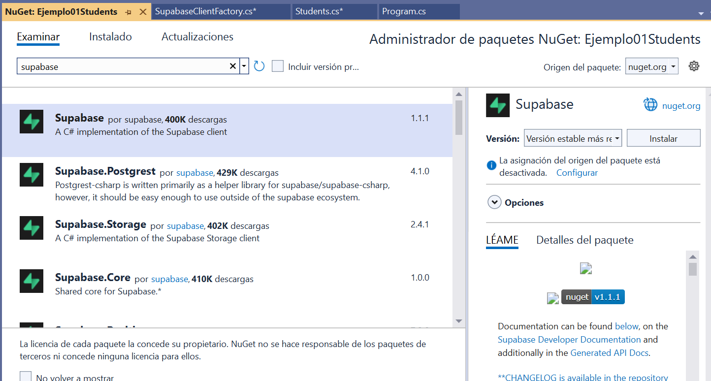


# <a name="_apartado3"></a>3. MVC

En nuestra aplicación vamos a utilizar **MVC** (Modelo-Vista-Controlador).

**MVC** es una forma de organizar el código para que cada parte de la aplicación tenga una responsabilidad clara. Esto nos ayuda a tener proyectos más ordenados, fáciles de mantener y más parecidos a lo que se hace en aplicaciones reales.

A grandes rasgos, MVC divide el proyecto en tres piezas:

🟦 1. Modelo (Model)

El Modelo representa los datos de la aplicación.

Aquí definimos clases como `Student`, `Course`, etc.

Cada clase describe qué información guarda un objeto (por ejemplo: Id, Name, Age).
No tiene lógica de interfaz ni sabe cómo se muestra en pantalla.
Es la **"estructura"** de la información.

Ejemplo: un alumno o un curso.

🟧 2. Vista (View)
La Vista es todo lo que el usuario ve e interactúa con ello.

En Flutter serían pantallas.
En web serían páginas HTML.
En consola: simplemente los textos que salen por pantalla.

La vista solo muestra información y recoge acciones del usuario.

🟩 3. Controlador (Controller)
El Controlador es el que toma decisiones.

Recibe **lo que hace el usuario** (por ejemplo: “ver alumnos”).
**Pide los datos** necesarios al repositorio o al modelo.
**Actualiza la vista** con esos datos.

Es el encargado de coordinar todo: Vista → Lógica → Datos.

📁 ¿Y el Repositorio?
Aunque no es parte del MVC clásico, lo usamos porque facilita mucho el trabajo.
El Repositorio es la capa que se encarga de hablar con la base de datos (Supabase en nuestro caso).

Tiene métodos como GetStudents(), InsertStudent(), UpdateStudent()…
Oculta los detalles de Supabase.
Permite trabajar con datos sin mezclar consultas dentro del controlador.

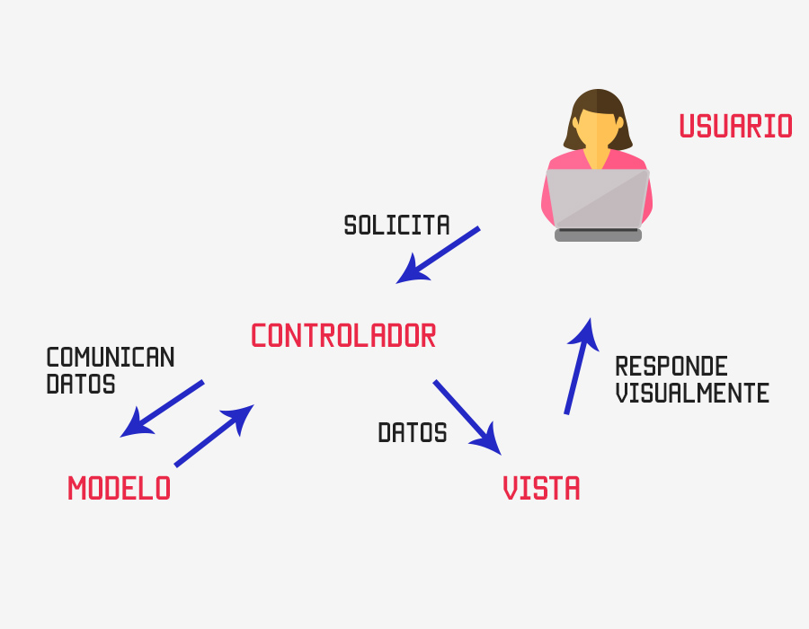

<br>
<br>

# <a name="_apartado4"></a>4. Programa Students. Modelo y Conexión Cliente Supabase

## Modelo

Vamos a empezar creando el modelo de datos para nuestro programa.
Agregamos en nuestro Explorador de Soluciones una nueva carpeta llamada `Model`.

El modelo de datos va a ser una clase que nos represente un registro de nuestra tabla students. 
Creamos en nuestro proyecto (dentro de esa carpeta) esta nueva clase:

```csharp
// Models/Student.cs
using Supabase.Postgrest.Attributes;
using Supabase.Postgrest.Models;

namespace Ejemplo01Students.Models
{
    [Table("students")]
    public class Student : BaseModel
    {
        [PrimaryKey("id", false)]
        public int? Id { get; set; }
        [Column("name")]
        public string Name { get; set; } = "";
        [Column("age")]
        public int Age { get; set; }

        public Student() { }

        public Student(int? id, string name, int age)
        {
            Id = id;
            Name = name;
            Age = age;
        }

    }
}
```

En la clase, de momento, encontramos las propiedades que se corresponden con los campos de la tabla y los constructores. También heredamos de BaseModel, y ponemos una serie de anotaciones, para evitar tener que hacer un mapeo de lo que nos devuelve la llamada a la tabla.

## Cliente de Supabase


Vamos a crear ahora una clase para hacer la conexión con Supabase.
Creamos la carpeta `Data` y en ella la siguiente clase `SupabaseClientFactory`:

```csharp
using Supabase;

namespace Ejemplo01Students.Data
{
    public static class SupabaseClientFactory
    {
        private static Client? _client;
        private static bool _initialized = false;

        // 🔹 Pon aquí tu URL y tu ANON KEY directamente
        private const string SUPABASE_URL = "https://TU-PROYECTO.supabase.co";
        private const string SUPABASE_ANON_KEY = "TU-ANON-KEY";

        public static async Task<Client> GetClientAsync()
        {
            if (_initialized && _client is not null)
                return _client;

            var options = new SupabaseOptions
            {
                AutoConnectRealtime = false
            };

            _client = new Client(SUPABASE_URL, SUPABASE_ANON_KEY, options);
            await _client.InitializeAsync();

            _initialized = true;
            return _client;
        }
    }
}
```
Esta clase estática nos define una función que permite conectar con el cliente de Supabase. Lo hace de manera asíncrona. Dejamos la explicación informal de la asincronía para la clase presencial.

Donde tenemos las constantes `SUPABASE_URL` y `SUPABASE_ANON_KEY` tendremos que poner nuestra url de proyecto de Supabase y nuestra clave anónima.
Lo encontramos dentro de Supabase.

La url en Project Settings->Data API:

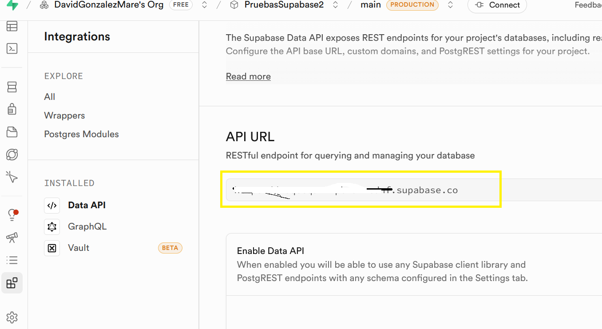

Y la clave anon en Project Settings->API Keys:

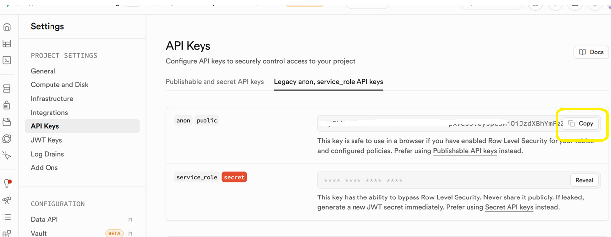

Si queremos probar la conexión con Supabase en nuestro Main podemos hacer:

```csharp
    internal class Program
    {
        static async Task Main(string[] args)
        {
            var client = await SupabaseClientFactory.GetClientAsync();
            Console.WriteLine("Cliente Supabase inicializado.");
        }
    }
```

Tener en cuenta que el Main se convierte ahora en una función asíncrona. **Lo explicaremos en clase**.

# <a name="_apartado5"></a>5. Programa Students. Repositorio

El **repositorio** será la clase que hace las llamadas para las operaciones **CRUD** en nuestra tabla de Supabase. Para eso utilizará el cliente que creamos con la clase `SupabaseClientFactory`.

De momento únicamente vamos a crear la carpeta `Repositories`, con el fichero clase `StudentsRepository` en el que, de momento, vamos a obtener todos los estudiantes de nuestra tabla:

### Obtener estudiantes

```csharp
using Supabase;
using Ejemplo01Students.Models;

namespace Ejemplo01Students.Repositories
{
    public class StudentsRepository
    {
        private readonly Client _client;
        public StudentsRepository(Client client)
        {
            _client = client;
        }

        // Obtiene la lista de estudiantes
        public async Task<List<Student>> GetAllAsync()
        {
            var response = await _client.From<Student>().Get();

            // La convierte a una lista del modelo.
            return response.Models ?? new List<Student>();
        }
    }
}
```

Y lo podemos probar así en nuestro programa principal:

```csharp
    internal class Program
    {
        static async Task Main(string[] args)
        {

            var client = await SupabaseClientFactory.GetClientAsync();
            var repo = new StudentsRepository(client);

            var students = await repo.GetAllAsync();
            foreach (var s in students)
                Console.WriteLine($"{s.Id} - {s.Name} - {s.Age}");

        }
    }
```

### Insertar nuevo estudiante

Implementamos ahora en nuestro fichero `/Repositories/StudentsRepository.cs` el método que nos permite añadir un estudiante a nuestra tabla. Añadimos el siguiente método:

```csharp
        public async Task<Student?> InsertAsync(Student student)
        {
            var response = await _client.From<Student>().Insert(student);
            return response.Models?.FirstOrDefault() ?? null;
        }

```

Y lo podemos probar en nuestro `Main`:

```csharp
    static async Task Main(string[] args)
    {

        Client client = await SupabaseClientFactory.GetClientAsync();
        var repo = new StudentsRepository(client);

        // 1) Insertar
        var inserted = await repo.InsertAsync(new Student(null, "Miguel González", 25));
        Console.WriteLine($"Insertado: {inserted?.Id} - {inserted?.Name} - {inserted?.Age}");

        var students = await repo.GetAllAsync();
        foreach (var s in students)
            Console.WriteLine($"{s.Id} - {s.Name} - {s.Age}");
    }
```

### Resto de operaciones CRUD

Vamos a implementar las operaciones CRUD que nos quedan: Borrar y Update en nuestro `StudentsRepository`:

```csharp
        // Actualizar estudiante
        public async Task<Student?> UpdateAsync(Student student)
        {
            var response = await _client
                .From<Student>()
                .Update(student);

            return response.Models?.FirstOrDefault() ?? null;
        }

        // Borrar por ID

        // Borrar por ID mediante modelo con PK (evita Filter)
        public async Task<bool> DeleteAsync(int id)
        {
            var toDelete = new Student(id, string.Empty, 0); // solo importa el Id
            var response = await _client.From<Student>().Delete(toDelete);
            return response.Models != null && response.Models.Count > 0;
        }
```

Podríamos probar nuestras funciones mediante el siguiente `Program Main`:

```csharp
    internal class Program
    {
        static async Task Main(string[] args)
        {
            try
            {
                Client client = await SupabaseClientFactory.GetClientAsync();
                var repo = new StudentsRepository(client);

                Console.WriteLine("=== PRUEBAS CRUD SEGUIDAS (SIN GetById) ===");

                // 1) Insertar estudiante
                Console.WriteLine("\n-- Insertando estudiante...");
                var inserted = await repo.InsertAsync(new Student(null, "Prueba Inicial", 20));
                Console.WriteLine($"Insertado: {inserted?.Id} - {inserted?.Name} - {inserted?.Age}");

                // 2) Listar todos
                await MostrarLista(repo, "\n-- Lista tras Insert:");

                // 3) Actualizar usando el objeto insertado
                if (inserted is not null)
                {
                    Console.WriteLine("\n-- Actualizando estudiante...");

                    inserted.Name = "Prueba Actualizada";
                    inserted.Age = 21;

                    var updated = await repo.UpdateAsync(inserted);
                    Console.WriteLine(updated is not null
                        ? $"Actualizado: {updated.Id} - {updated.Name} - {updated.Age}"
                        : "Update devolvió null");
                }

                // 4) Lista de nuevo
                await MostrarLista(repo, "\n-- Lista tras Update:");

                // 5) Borrar
                if (inserted?.Id is int idToDelete) // Porque insterted.Id es nullable
                {
                    Console.WriteLine("\n-- Borrando estudiante...");
                    var deleted = await repo.DeleteAsync(idToDelete);
                    Console.WriteLine(deleted ? "Borrado OK" : "No se encontró para borrar");
                }

                // 6) Lista final
                await MostrarLista(repo, "\n-- Lista final tras Delete:");

                Console.WriteLine("\n=== FIN DE PRUEBAS ===");
            }
            catch (Exception ex)
            {
                Console.WriteLine("\n*** ERROR DURANTE LAS PRUEBAS ***");
                Console.WriteLine(ex.Message);
            }
        }

        // ------------------------
        //   Función auxiliar
        // ------------------------
        static async Task MostrarLista(StudentsRepository repo, string titulo)
        {
            Console.WriteLine(titulo);
            var students = await repo.GetAllAsync();

            if (students.Count == 0)
            {
                Console.WriteLine("(lista vacía)");
                return;
            }

            foreach (var s in students)
                Console.WriteLine($"{s.Id} - {s.Name} - {s.Age}");
        }
    }
```

# <a name="_apartado6"></a>6. Programa Students. Controlador

Como hemos explicado en apartados anteriores, estamos desarrollando nuestro programa con una arquitectura MVC (Modelo - Vista - Controlador).
El controlador funciona como una capa entre el modelo de datos, repositorio y la vista o interfaz.

El controlador es la pieza intermedia que se encarga de:

- Recibir peticiones del “mundo exterior” (en una consola: lo que tú quieras ejecutar desde Program.cs)
- Validar o preparar los datos
- Llamar al repositorio (que habla con Supabase)
- Devolver una respuesta procesada o “lista para usar”
  
Vamos a crear una nueva carpeta Controllers en nuestro proyecto y en ella vamos a crear el fichero `StudentsController`:

```csharp
namespace Ejemplo01Students.Controllers
{
    public class StudentsController
    {
        private readonly StudentsRepository _repo;

        public StudentsController(StudentsRepository repo)
        {
            _repo = repo;
        }

        // Crear estudiante desde datos primitivos
        public async Task<Student?> CreateAsync(string name, int age)
        {
            // Validación mínima (opcional). Si no la quieres, quítala.
            if (string.IsNullOrWhiteSpace(name))
                throw new ArgumentException("El nombre no puede estar vacío.", nameof(name));
            if (age < 0)
                throw new ArgumentOutOfRangeException(nameof(age), "La edad no puede ser negativa.");

            var student = new Student(null, name.Trim(), age);
            return await _repo.InsertAsync(student);
        }

        // Obtener toda la lista (el Program decide cómo mostrarla)
        public Task<List<Student>> GetAllAsync() => _repo.GetAllAsync();

        // Actualizar un estudiante ya existente (normalmente obtenido desde la lista)
        public async Task<Student?> UpdateAsync(Student student, string? newName = null, int? newAge = null)
        {
            if (student is null)
                throw new ArgumentNullException(nameof(student));

            if (newName is not null)
            {
                if (string.IsNullOrWhiteSpace(newName))
                    throw new ArgumentException("El nombre no puede estar vacío.", nameof(newName));
                student.Name = newName.Trim();
            }

            if (newAge is not null)
            {
                if (newAge < 0)
                    throw new ArgumentOutOfRangeException(nameof(newAge), "La edad no puede ser negativa.");
                student.Age = newAge.Value;
            }

            return await _repo.UpdateAsync(student);
        }

        // Borrar por Id
        public async Task<bool> DeleteAsync(int id)
        {
            if (id <= 0)
                throw new ArgumentOutOfRangeException(nameof(id), "Id debe ser > 0.");

            return await _repo.DeleteAsync(id);
        }
    }
}
```

Y nuestro `Main` quedaría muy parecido, pero "desacoplamos" del repositorio, y dependemos del controlador:

```csharp
namespace Ejemplo01Students
{
    internal class Program
    {
        static async Task Main(string[] args)
        {
            try
            {
                // 1) Inicializar cliente, repositorio y controlador
                Client client = await SupabaseClientFactory.GetClientAsync();
                var repo = new StudentsRepository(client);
                var controller = new StudentsController(repo);

                Console.WriteLine("=== PRUEBAS CON CONTROLADOR (flujo secuencial) ===");

                // 2) Crear estudiante
                Console.WriteLine("\n-- Creando estudiante...");
                var created = await controller.CreateAsync("Alumno Controlador", 19);
                Console.WriteLine($"Creado: {created?.Id} - {created?.Name} - {created?.Age}");

                // 3) Listar todos
                await MostrarLista(controller, "\n-- Lista tras Create:");

                // 4) Actualizar usando el mismo objeto creado
                if (created is not null)
                {
                    Console.WriteLine("\n-- Actualizando estudiante (solo nombre y edad)...");
                    var updated = await controller.UpdateAsync(created, newName: "Alumno Actualizado", newAge: 20);
                    Console.WriteLine(updated is null
                        ? "Update devolvió null"
                        : $"Actualizado: {updated.Id} - {updated.Name} - {updated.Age}");
                }

                // 5) Listar de nuevo
                await MostrarLista(controller, "\n-- Lista tras Update:");

                // 6) Borrar
                if (created?.Id is int idToDelete)
                {
                    Console.WriteLine("\n-- Borrando estudiante...");
                    var deleted = await controller.DeleteAsync(idToDelete);
                    Console.WriteLine(deleted ? "Borrado OK" : "No se encontró para borrar");
                }

                // 7) Lista final
                await MostrarLista(controller, "\n-- Lista final tras Delete:");

                Console.WriteLine("\n=== FIN DE PRUEBAS ===");
            }
            catch (Exception ex)
            {
                Console.WriteLine("\n*** ERROR DURANTE LAS PRUEBAS ***");
                Console.WriteLine(ex.Message);
            }
        }

        // Función auxiliar: obtiene la lista desde el controlador y la imprime
        static async Task MostrarLista(StudentsController controller, string titulo)
        {
            Console.WriteLine(titulo);
            var students = await controller.GetAllAsync();

            if (students.Count == 0)
            {
                Console.WriteLine("(lista vacía)");
                return;
            }

            foreach (var s in students)
                Console.WriteLine($"{s.Id} - {s.Name} - {s.Age}");
        }
    }
}
```

<hr>
EN ESTE PUNTO PODEMOS MANDAR COMO PRIMER EJERCICIO HACER LO VISTO HASTA AHORA, Y COMO SEGUNDO EJERCICIO HACER UN MENÚ PARA AÑADIR, EDITAR, ELIMINAR Y MOSTRAR.
<hr>